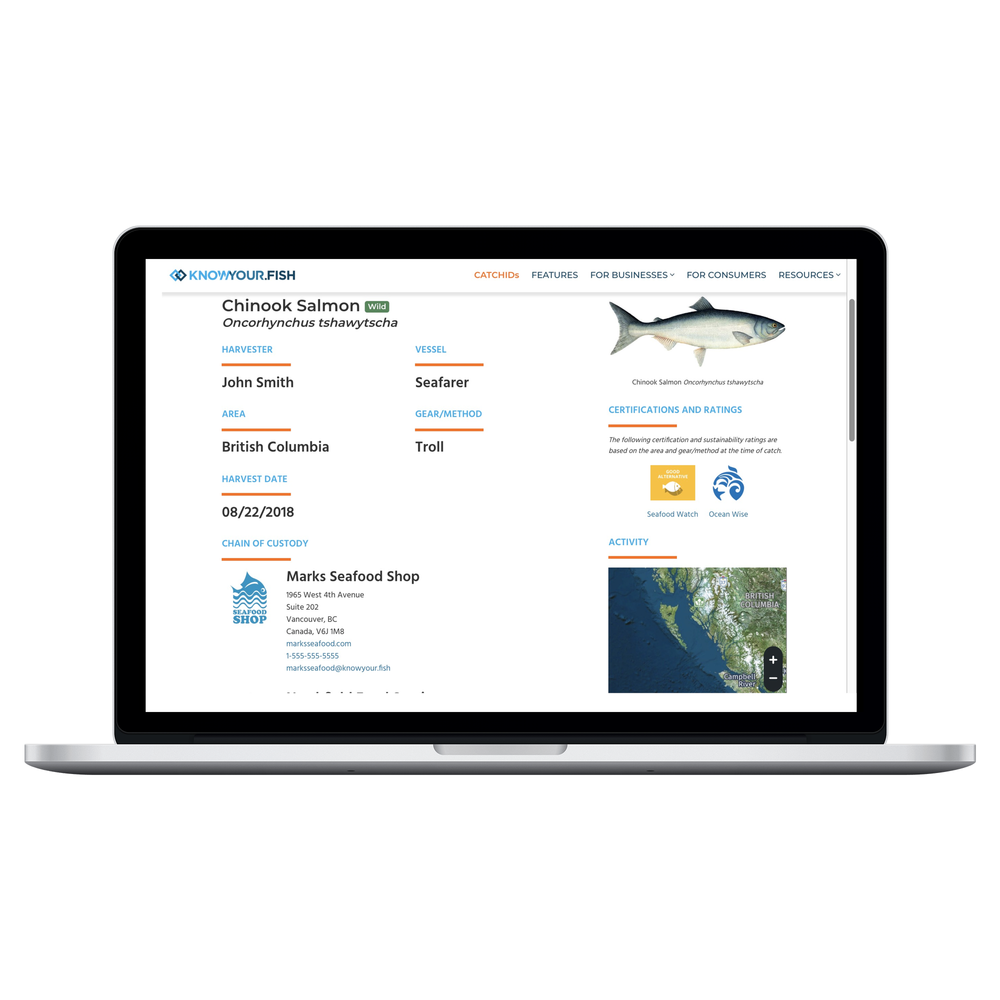

# Patrick Clery
_**Full-Stack Web Developer**_

# Skills

### <i class="fa fa-train"></i> Web Development 5/5
Get web applications up & running in short time with _Ruby On Rails_.

### <i class="fab fa-js"></i> UI/UX Design 4/5
Intuitive designs that load fast on mobile & desktop.

### <i class="fab fa-linux"></i> Technical Operations 4/5
_Docker_, cloud services, and general infrastructure best practices.

### <i class="fab fa-github"></i> Project Management 3/5
Get clarity on your _Github_ project's next actions.

# Portfolio
### [KnowYour.Fish](https://www.vericatch.com/products/knowyourfish/)

_**Ruby On Rails, PostgreSQL, JS**_
{: height="400px" width="400px"}

Designed specifically for the fishing industry to meet today’s needs of consumers, retailers, restaurants, distributors, and processors who require more information about seafood and where and how it was sourced.

### [Fisheries App](https://www.vericatch.com/products/fisheriesapp/)
_**Ruby On Rails + PostgreSQL + JS**_

{: height="400px" width="400px"}

Electronic reporting and supply chain management for fisheries. The backend is a _Ruby On Rails_ application with a companion _Android_ client that fisherman used to submit reports. 

{: height="400px" width="400px"}
