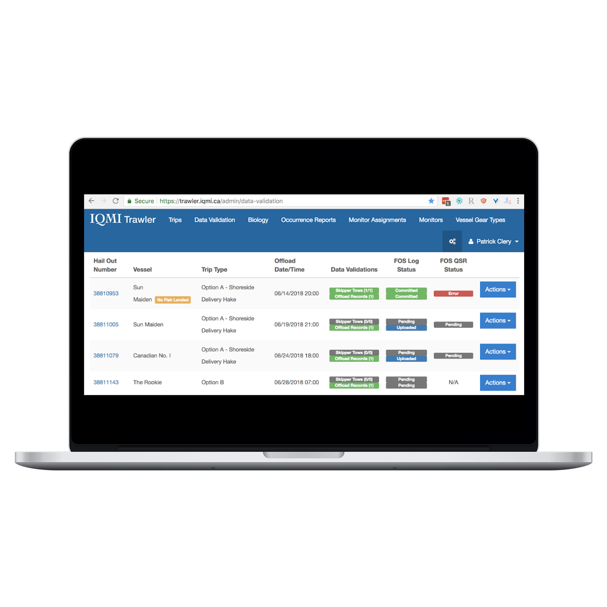

# Patrick Clery
## Web Developer
## Ruby + SQL + Javascript

## My Services

I'm a Ruby On Rails developer living in Vancouver, Canada. My typical development stack is Ruby + PostgreSQL + Javascript. To see a full list of which development tools I use, [click here](#development-tools).

{: height="400px" width="400px"}

### Build or modify your Ruby On Rails website.

I use _Ruby On Rails_ to build websites that buy, sell, publish, or do whatever you need it to do.  

### Manage your Ruby on Rails project.

I can organize & assign tasks for teams through _Github_, as well as work with project managers through Github and common _Agile_ workflows.

### Design easy-to-use forms and pages.

I create simple they're easy for you and your visitors to look at.

# Portfolio

{: height="400px" width="400px"}
### [KnowYour.Fish](https://www.vericatch.com/products/knowyourfish/)
_**Ruby On Rails + JS**_
Designed specifically for the fishing industry to meet today’s needs of consumers, retailers, restaurants, distributors, and processors who require more information about seafood and where and how it was sourced.

{: height="400px" width="400px"}
### [Fisheries App](https://www.vericatch.com/products/fisheriesapp/)
_**Ruby On Rails + JS**_
Electronic Reporting for Fisheries Management

