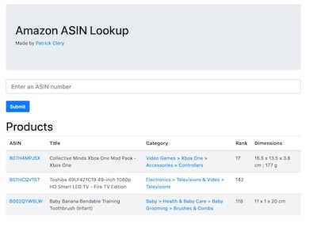
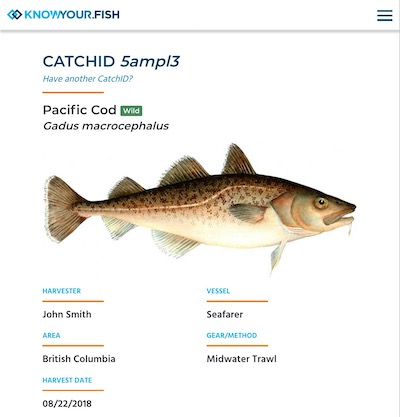
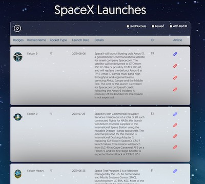

PATRICK CLERY
=============
Ruby on Rails Developer
-----------------------
> I'm a freelance web developer of over twenty years who builds
> single-page apps using **Ruby on Rails & React.JS**. Whether you're
> looking to start a new project, add features to an existing one, or add
> an experienced developer to your team -- *I can do it*.

|                        | Skills Summary                |
|:----------------------:|:------------------------------|
| :martial_arts_uniform: | Ruby on Rails Ninja           |
|    :male_detective:    | PostgreSQL Database Detective |
|  :man_factory_worker:  | React.js Experience Engineer  |
|       :basecamp:       | Agile Design Advocate         |
|        :whale2:        | Docker Boat Captain           |

# PROFESSIONAL EXPERIENCE (FREELANCE WORK)

### Freelance Web Development (2007 - Present)

#### Web Application Development with Ruby on Rails

- ***RESTful or GraphQL API Design*** that is compliant to Google's
  ***JSON:API standards***.
- ***Database architecture*** with well-defined validations and indexes
  using ***ActiveRecord*** and ***PostgreSQL***.
- ***Advanced PostgreSQL operations***: Procedural Programming, Views,
  Triggers, ***Query Analysis, Optimization***.
- ***Data scraping*** with Regular Expressions & XPath using Nokogiri.
- Uploading & serving files from ***Amazon S3*** buckets using
  ***ActiveStorage***.
- ***User Authentication & Access Restriction***: OAuth, Devise with
  Warden or Pundit, ***2-Factor Authentication with Twilio***.

#### UI/UX Development with React.JS

- Creating ***Single-Page Applications*** with ***React Router*** that
  deliver a modern user experience.
- Styling pages with ***Bootstrap CSS***, a popular design framework
  with a clean feel.
- ***Converting design files*** from Figma, Sketch, or PhotoShop into a
  functional webpage.
- Configuring apps to easily drop-in new CSS and JavaScript files with
  ***Webpack, Babel, and SASS***.

#### Deployment, Version Control, and DevOps

- Deploying to ***Heroku*** for production, developers, and testing
  stages.
- ***Configuring Docker containers, images, and swarms*** using
  docker-compose and Dockerfile.
- ***Branching, releasing, and versioning*** software through GitHub.
- Managing assets with ***Amazon S3*** buckets.
- ***Automating CI/CD services***: Sentry, CircleCI, GitHub Actions,
  Docker Hub, Heroku, CodeCov.
- ***10 years experience with Linux/Unix operations***: shell scripting,
  key management, networking, package management.

#### Workflows & Methodologies

- Using GitHub Projects to implement ***Agile Design*** and ***SCRUM***
  practices.
- ***Test-Driven Development*** with unit and integration tests using
  ***RSpec & Capybara***.
- ***Conducting code reviews***, doing ***live feature
  demonstrations***, ***interviewing and on-boarding new developers***.
- Full-stack development in ***RubyMine by JetBrains***, including
  deployment, version control, and database operations.
- Follower of the business & software development practices promoted by
  ***Jason Fried, David Heinemeier Hansson, and Basecamp.com***.

## PROFESSIONAL EXPERIENCE (ON TEAMS)

### Vericatch.com (On-Site - Vancouver, BC)

#### Ruby on Rails Developer (March 2018 - November 2018)

>*Developed back-end and front-end features for 3 commercial apps that
>provides services for supply-chain management, fishing industry
>regulations, and provincial catch reporting (1 app in production for 7
>years, 2 new apps that were developed and sold).*

- Wrote ***PostgreSQL*** queries that power the Supply Chain database,
  often spanning 50+ lines.
- Analyzed & optimized ***PostgreSQL*** performance in ***Ruby on
  Rails***.
- ***Reviewed 3+ Pull Requests Per Week*** for a team of 4 Ruby on Rails
  developers.
- Followed ***Test-Driven Development*** methodology using RSpec, using
  ***Capybara*** for integration tests.
- Restricted User & Group access to features ***Devise & Warden***.
- Created reusable UI components using ***Bootstrap CSS***.
- Shared senior developer duties of ***Interviewing & On-boarding*** new
  developers.
- Deployed applications on ***DigitalOcean*** through ***Ansible***.
- Configured ***Amazon Web Services*** to for hosting images and assets.
- ***Handled user support requests*** and application errors from
  ***Sentry*** within 24-hours.
- Worked in 2-week ***SCRUM*** sprints along with ***Agile Design***
  workflow that was setup through ***GitHub Projects***.
- ***Delivered live presentations*** to development team when adding new
  features.

# EXAMPLES OF MY WORK

> Here's just a few projects I'm proud of.
> (Click the live link to see them in action!)

### :shopping_cart: *Amazon ASIN Lookup*

| Description: | Search Amazon by Product Number (ASIN) without paying for the API        |
|-------------:|:-------------------------------------------------------------------------|
|        Type: | Coding Challenge / For Fun                                               |
|   Live Demo: | https://amazon-asin-checker.herokuapp.com/                               |
|      GitHub: | https://github.com/patrickclery/amazon-asin                              |
|  Tech Stack: | Ruby on Rails, React.js, PostgreSQL, Docker                              |
|  Screenshot: |  |

### :fish: KnowYour.Fish

| Description: | Verified traceability for the seafood supply chain.         |
|-------------:|:------------------------------------------------------------|
|        Type: | Paid Work (Contributor)                                     |
|        Link: | [KnowYour.Fish](https://knowyour.fish/)                     |
|  Tech Stack: | Ruby on Rails, PostgreSQL, Bootstrap CSS                    |
|  Screenshot: |  |

### :rocket: *SpaceX Flights*

| Description: | Get information on any SpaceX flight in history!       |
|-------------:|:-------------------------------------------------------|
|        Type: | Coding Challenge / For Fun                             |
|   Live Demo: | https://spacexflights.herokuapp.com/                   |
|      GitHub: | https://github.com/patrickclery/spacex                 |
|  Tech Stack: | Ruby on Rails, React.js, PostgreSQL, Docker            |
|  Screenshot: |  |

# HOW TO CONTACT ME

|    Contact Methods    |                                      |
|:---------------------:|:-------------------------------------|
|        :email:        | patrick.clery@gmail.com              |
|        :phone:        | +1.778.990.9803                      |
| :busts_in_silhouette: | https://linkedin.com/in/patrickclery |
|       :octocat:       | https://github.com/patrickclery      |
|        :bird:         | https://twitter.com/patrickclery     |

